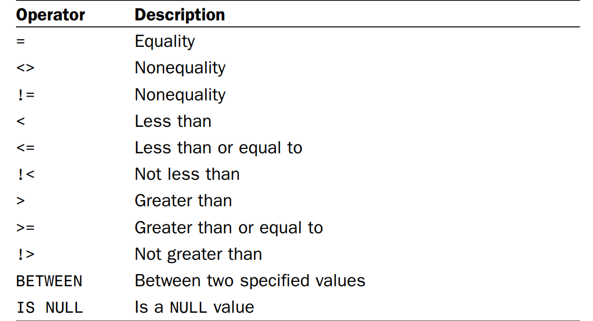

# SQL Statements and Case
It is important to note that SQL statements are not case sensitive. Therefore, SELECT is the same as select, which is the same as Select. Many SQL developers find that using uppercase for all SQL keywords and lowercase for column and table names makes code easier to read and debug.

# Retrieving Multiple Columns
Use comma separated column names. Do not use trailing comma as it will raise error.

# Retrieving Distinct Rows
```
SELECT DISTINCT vend_id
FROM products;
```
Distinct applies to all selected columns. `DISTINCT a, b, c` would select all possible distinct combination.

# Limiting Results

```
SELECT prod_name
FROM products
limit 5;
```

# Sorting Data
```
SELECT prod_name
FROM products
ORDER BY prod_name;
```

# Sorting by Multiple Columns

To sort by multiple columns, simply specify the column names separated by commas.

```
SELECT prod_id, prod_price, prod_name
FROM products
ORDER BY prod_price, prod_name;
```

# Specifying Sort Direction
To sort by descending order, you must specify the keyword DESC.
```
SELECT prod_id, prod_price, prod_name
FROM products
ORDER BY prod_price DESC;
```

# Sorting Descending on Multiple Columns
If you want to sort in descending order on multiple columns, be sure each column has its own DESC keyword.

# Case Sensitivity and Sort Orders

If case matters, then it is possible to get result as following: A, B, C, a, b, c. Result varies from dbms to dbms. In mysql, case matters.

# Position of the ORDER BY Clause
When specifying an ORDER BY clause, be sure that it is after the FROM clause. Using clauses out of order will generate an error message.

# WHERE Clause Position
When using both ORDER BY and WHERE clauses, make sure ORDER BY comes after WHERE; otherwise, an error will be generated.

# The WHERE Clause Operators


# Checking for a Range of Values
```
SELECT prod_name, prod_price
FROM products
WHERE prod_price BETWEEN 5 AND 10;
```

# Checking for No Value
The SELECT statement has a special WHERE clause that can be used to check for columns with NULL values, the IS NULL clause. The syntax looks like this:

```
SELECT prod_name
FROM products
WHERE prod_price IS NULL;
```
