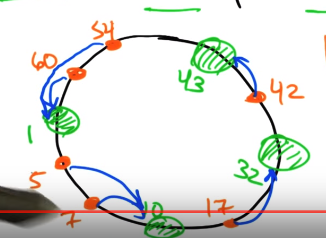

# Consistent Hashing

Keys and nodes map to same id space.

**How does key map to nodes?**

Key id belongs to **successor** nodes.

Suppose the the logical ring has 2^m positions. The nodes id can be found by using Sha1(ip_address) and simply taking the first m bits.

# Information Stored

Each node in the logical ring knows the ip-address of the immediate successor node.

Each node also keeps a finger table.

# Finger Table

Each node keeps a table with m rows. Each row $i$ contains the successor of $x$, where $x = id + 2^i$ and $id$ is the id of node.

# Key Search

Ask a node to find out where key k is located. The node will look for the biggest value x <= k present in its finger table and send the request to that node containing x. If no such value is found, the request is simply sent to the next node.

# Node Failure

Instead of keeping just the successor, we can keep multiple successor. This helps when one of the intermediate node fails. Keeping 2*log(n) number of successors greatly reduces the chance of failure when n is large.

# Property

1. **Load Balancing**: All nodes receives roughly the same amount of key.
1. **Flexibility**: If any node joins or leaves, only a fraction of the key need to be redistributed.

# Resources

1. [Youtube - Consistent Hashing](https://www.youtube.com/watch?v=--4UgUPCuFM)
